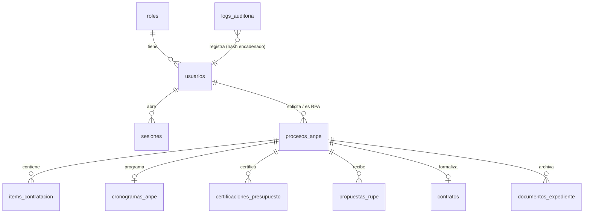
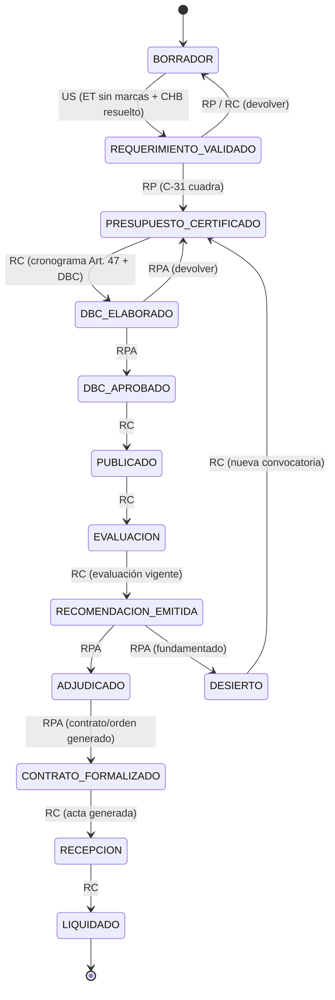

# Arquitectura

## Estructura del proyecto

```
sabsmuni-anpe/
├── docker-compose.yml · .env.example · scripts/{init-env,backup}.sh
├── backend/                         NestJS + Prisma (TypeScript)
│   ├── prisma/schema.prisma         modelo de datos, enums estrictos
│   ├── prisma/migrations/           migraciones versionadas (migrate deploy)
│   └── src/
│       ├── domain/                  ★ LÓGICA LEGAL/ARITMÉTICA PURA (sin I/O, 100 % testeable)
│       │   ├── calendario-bolivia.ts   feriados fijos y móviles (Pascua), días hábiles
│       │   ├── cronograma.ts           Art. 47 D.S. 0181, rango ANPE, validación de fechas
│       │   ├── evaluacion.ts           V-1, subasta, márgenes, PEMB, CPC, cuadro comparativo
│       │   ├── garantia.ts             garantía 7 % / 3,5 %, contrato vs. orden ≤ 15 días
│       │   ├── chb.ts                  cruce UNSPSC ↔ catálogo nacional, justificación
│       │   ├── especificaciones.ts     detector de marcas / especificaciones dirigidas
│       │   ├── sigep.ts                validación C-31, glosa, bloque de transcripción
│       │   ├── flujo.ts                máquina de estados + permisos por rol
│       │   ├── integridad.ts           SHA-256, JSON canónico, cadena de auditoría, sello de expediente
│       │   └── money.ts                aritmética en centavos, monto en letras
│       ├── common/                  Prisma, auditoría, JWT/RBAC (guards), almacenamiento, calendario
│       ├── modules/{auth,admin,procesos,documentos}/   controladores REST + servicios
│       └── pdf/                     motor PDF (pdfkit) y 11 plantillas oficiales
└── frontend/                        Next.js 15 + Tailwind + componentes estilo shadcn/ui
    └── src/{app,components,lib}/    login, procesos, detalle con 6 pestañas, admin, verificación pública (QR)
```

**Decisión de diseño:** las reglas de la contratación viven en `domain/` como funciones puras. Los servicios
solo cargan datos, llaman a esas funciones, persisten y auditan. Así cada regla normativa se prueba
sin base de datos y puede ajustarse sin tocar controladores.

**Motor PDF:** se eligió `pdfkit` + `pdf-lib` + `qrcode` (puro Node) en lugar de Puppeteer/WeasyPrint para no
incluir un navegador ni dependencias nativas en la imagen y poder probarlo en CI.

## Modelo de datos



Tablas del brief con sus campos (`procesos_anpe`, `items_contratacion`, `cronogramas_anpe`, `certificaciones_presupuesto`,
`propuestas_rupe`, `documentos_expediente`, `usuarios`, `roles`, `sesiones`, `logs_auditoria`) más: `contratos`,
`config_institucional`, `feriados`, `catalogo_partidas`, `catalogo_chb`, `marcas_registradas`.
Campos añadidos al brief: `puntaje_tecnico`, `categoria` y `v1` (JSON) en propuestas; `hash_contenido` y `version` inmutable en
documentos; `requerimiento`/`evaluacion` (JSON) en procesos. Importes `DECIMAL(14,2)`.

## Flujo secuencial obligatorio


`CANCELADO` es alcanzable desde cualquier estado no terminal y solo por el RPA.
Al cruzar cada transición el sistema emite automáticamente los documentos oficiales del paso
(C-1, C-31, DBC, V-1, cuadro, informe, resolución).

## Matriz de permisos (RBAC)

| Operación | US | RP | RC | RPA | ADMIN |
|---|:-:|:-:|:-:|:-:|:-:|
| Crear/editar solicitud, ítems, ET/TdR, validar CHB | ✔ | | | | |
| Registrar certificación C-31 | | ✔ | | | |
| Cronograma, propuestas, V-1, evaluación | | | ✔ | | |
| Aprobar DBC, adjudicar/desierto, cancelar | | | | ✔ | |
| Generar contrato/orden | | | ✔ | ✔ | |
| Recepción y acta | | | ✔ | | |
| Compilar expediente | | | ✔ | ✔ | |
| Usuarios, configuración, catálogos | | | | | ✔ |
| Consultar auditoría y verificar su integridad | | | | ✔ | ✔ |
| Consultar procesos y descargar documentos | ✔ (propios) | ✔ | ✔ | ✔ | ✔ |

La Unidad Solicitante solo ve y modifica sus propios procesos. El rol RC cubre también a la Comisión de Calificación.

## Seguridad

- Contraseñas con bcrypt (costo 12); política mínima de 10 caracteres con letras y números.
- Access JWT de 15 min y refresh de 7 días **rotativo**: reutilizar un refresh ya usado revoca todas las sesiones del usuario.
- Cookies `HttpOnly`, `SameSite=Strict`, `Secure` en producción; el navegador solo habla con el origen del frontend (proxy `/api`).
- `helmet`, CORS restringido a `PUBLIC_URL`, validación `whitelist + forbidNonWhitelisted`, límite de tasa global y específico para login.
- Documentos **inmutables** (`flag: wx`): cada regeneración crea una versión nueva; la descarga recalcula el SHA-256 y falla si no coincide.
- Auditoría: `hash = SHA-256(hash_previo ‖ JSON canónico del registro)`; `GET /api/auditoria/verificar` detecta ediciones o borrados.
- Imagen de backend sin privilegios (`USER node`), PID 1 con `tini`, base de datos sin puerto publicado.
